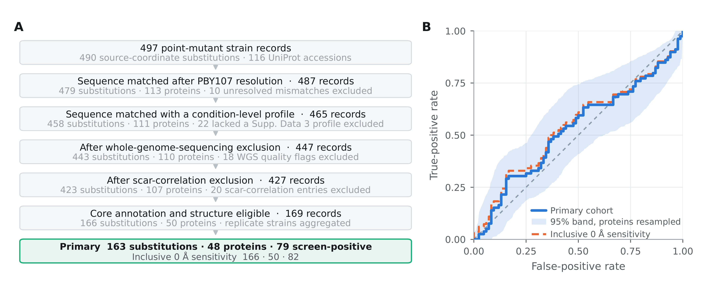
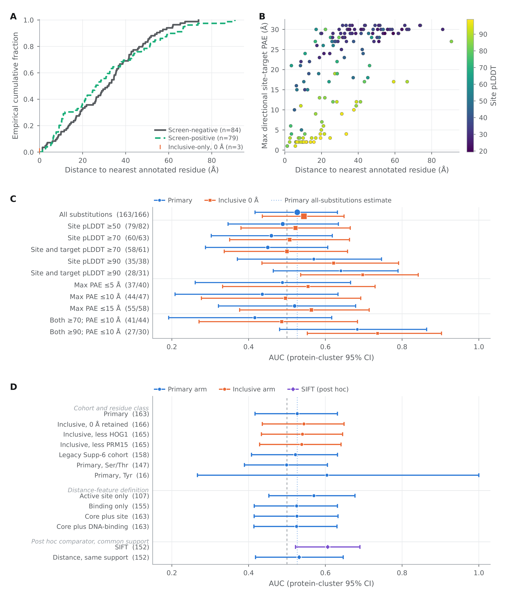

# No structural or sequence proximity feature is distinguishable from chance in a yeast phosphosite-mutant screen

**Kyle Nguyen**^1^, **Arkady Marchenko**^2^

^1^ Human Biology, College of Natural Sciences, The University of Texas at Austin, Austin, Texas, USA

^2^ Department of Computer Science, College of Natural Sciences, The University of Texas at Austin, Austin, Texas, USA

**Author note:** The affiliations identify where the authors study. This work was carried out independently of the university, without institutional funding, supervision, or resources, and implies no endorsement by The University of Texas at Austin.

## Abstract

Studies that rank which protein modification sites are worth following up often lean on a structural shortcut: how close a site sits to a residue already annotated as part of an active site or a binding site. This paper asks what that measurement is actually made of.

The data are a published screen in budding yeast (*Saccharomyces cerevisiae*), in which serine, threonine and tyrosine sites were each replaced by alanine and the resulting strains grown across a panel of up to 102 growth conditions. For every replaced site we measured the shortest distance between any non-hydrogen atom of that residue and any non-hydrogen atom of the nearest annotated residue, in an AlphaFold DB version 6 model of the protein on its own, and called a site affected when the original study reported a growth change in at least one condition, in either direction.

What the measurement rests on is mostly not experimental, and mostly not within a protein. Among 163 sites in 48 proteins, 79 of them affected, 143 of the 163 nearest annotated residues (87.7%) were not established experimentally, most of them assigned by automated rules and the rest inferred from similar proteins or by curators, ATP is the bound molecule at 86 of them (52.8%), and 24 of the 48 proteins are kinases. Five of the ten sites lying within 5 Å of their nearest target are simply the next residue along the chain, 1.33–1.34 Å away, which is the length of the bond joining one residue to the next. The ranking statistic compares 6,636 affected/unaffected site pairs, and only 176 of them (2.65%) are two sites in the same protein.

Measured on that composite, distance ranked sites with an area under the ROC curve of 0.527, where 0.5 is what an uninformative measurement gives (95% confidence interval 0.417–0.632, resampling whole proteins); a second version of the cohort, which also keeps the three sites that are themselves annotated residues and so sit at zero distance, gave 0.544 on 166 sites (0.436–0.649). Shuffling the outcome labels 20,000 times centres at 0.500 with a standard deviation of 0.045, putting the observed value 0.59 standard deviations out (p = 0.55), and for each of seven alternative predictors measured on the same 163 sites, the interval on its difference from distance includes zero. One further comparator, sequence conservation, does separate affected from unaffected sites on the 152 sites it covers (0.606, 0.522–0.690), so the outcome is not one that nothing predicts; its difference from distance also includes zero. Keeping only annotations confirmed by experiment leaves 24 of the 163 sites, in 7 proteins, so this design cannot be asked whether better annotation would change the answer. Everything here is specific to this cohort, this definition of an affected site, and models of single proteins.

**Keywords:** phosphorylation; AlphaFold; yeast; mutational phenotype; structural bioinformatics; exploratory analysis

## 1. Introduction

A phosphosite is a serine, threonine or tyrosine that the cell can tag with a phosphate group to change how a protein behaves. Most phosphosites that have been observed have no assigned function. Methods that pick out the ones worth studying therefore score each site by combining several kinds of evidence: how conserved the position is across species, the surrounding sequence, the protein domain it sits in, how exposed it is on the surface, whether it lies where two proteins touch, and how close it sits to a residue already annotated as an active site or a binding site [1–4]. That last item, proximity, is one ingredient inside a composite score. In a literature sweep completed on 11 August 2026, we located no method, database, or paper that ranks or scores sites by distance to the nearest annotated active or binding residue on its own.

The 5 Å figure that travels with this idea traces to Strumillo et al. [2]. They mapped conserved phosphorylation hotspots onto experimentally determined structures from the Protein Data Bank and tested closeness to catalytic residues with Fisher's exact test. In enzyme domains, 3.3% of hotspot residues lie within 5 Å of a catalytic residue against 0.97% of other residues, which they report as hotspot positions being "5 times more likely to be within 5 Å distance" of a catalytic residue (p = 1.5 × 10⁻⁸). A 15 Å criterion appears in the same analysis. That figure is an enrichment ratio: one group of residues compared against the other residues of the same proteins. No individual site is classified by its distance, and the area under the ROC curve that the paper reports belongs to a conservation p-value.

Similar distance figures elsewhere in the field are cut-offs for deciding that two residues touch. PTMcode v2 calls two modified residues in contact below 4.69 Å, a threshold set from the average distance of twelve interacting pairs reported in the literature [5]. ProtVar highlights residues at a contact between two chains at 8 Å [6], and HotSpot3D pairs mutations within 20 Å [7]. None of the three ranks sites.

Beltrao et al. [8] is the yeast precedent for prioritizing modification sites by evolutionary and structural context. Phosphorylation happens often at the surfaces where two proteins touch [9]. A model of a protein on its own — a monomer model, which is what is used here — contains no such surface, because the partner is absent. Modelling a complex requires AlphaFold-Multimer [10], and no complex model is used here.

StructureMap [4] is the closest methodological relative. It also works from AlphaFold monomer coordinates, binning distances at 1 Å up to 35 Å in 5 Å steps, with co-localization bins starting at 0 Å and no minimum separation along the sequence. Its headline structural variable is side-chain exposure, computed within a 12 Å radius and a 70° angle, and it reports no discrimination statistic for distance taken on its own. The 59-feature functional score of Ochoa et al. [3] names "1D structural properties, phosphorylation structural hotspots, structural stability and interfaces and protein topology annotations", but the list of what each feature contributes sits in a supplement we could not obtain. Neither study therefore supplies a single-feature value to set beside the estimate reported here.

Figure 2d of Viéitez et al. [1] reports areas under the ROC curve for sorting sites into loss-of-function or gain-of-function against unchanged, using categories of evidence that include "position on protein structure". The area under the ROC curve, written AUC below, is the chance that a randomly chosen site with a growth change is ranked ahead of a randomly chosen site without one, where 0.5 is what an uninformative measurement gives. The values behind those categories are distributed in their Supplementary Data 6.

What that figure measures and what this paper measures are three different things. The outcome here is a single yes-or-no label: did the source report a growth change at this site in at least one condition, in either direction. It is not a loss-versus-gain call against unchanged. The predictor here is one continuous number declared in advance: the shortest distance between any non-hydrogen atom of the replaced residue and any non-hydrogen atom of the nearest residue that UniProt annotates as an active site (`ACT_SITE`) or a binding site (`BINDING`), with records that span several residues expanded to every residue they span. This is the minimum heavy-atom distance, called the distance below. And the cohort here is rebuilt from the condition-by-condition screening data to 163 replaced sites in 48 proteins; Supplementary Data 6 supplies annotations only and takes no part in deciding which sites are eligible or in the outcome. We did not retrieve the numeric values plotted in Figure 2d and make no comparison against them.

To our knowledge, based on searches of Europe PMC, publisher full texts, and tool documentation as of 11 August 2026, no earlier study tests distance from a phosphosite to the nearest annotated active or binding residue against a phenotype measured in a mutant screen. The closest published work measures a different relation between residues. Huang et al. [11] found structural distance to be the single most discriminating feature for cross-talk between two modifications on the same protein, at an AUC of 0.815.

This paper asks four things about one measurement. First, what the cohort of sites and the set of annotated target residues are actually made of. Second, whether distance separates the sites the screen reported a growth change at from the rest. That is tested against a permutation null, meaning the outcome labels shuffled at random many times to show what the measurement returns when there is nothing to find; against other predictors computed on exactly the same sites; and under stricter and direction-specific definitions of what counts as an affected site. Third, what distance stands in for, both at very short range and when sites in different proteins are compared. Fourth, what a study of this size, with this outcome and this annotation, can settle at all.

The fourth question can be answered before any estimate is reported. Uncertainty here is expressed by resampling whole proteins rather than individual sites, a protein-cluster bootstrap, because sites in the same protein are not independent of one another. The 95% interval built that way around the primary AUC (163 replaced sites) has a half-width of 0.107. The lowest and highest single-feature point estimates reported on this cohort are 0.527 and 0.606, a spread of 0.079. Those two estimates rest on different numbers of sites, 163 against 152, so the spread is indicative and not a like-for-like contrast. Read with that caveat, the arithmetic says the study cannot resolve differences of the size it is measuring. It does not license putting the features in order, and no such ordering appears anywhere below.

The analysis is exploratory. The main quantity to be estimated was fixed after the outcome data had already been looked at, and none of the round-2 analyses reported here was registered in advance. Methods §4.1 gives the order in which things happened and marks what was decided after seeing results.

## Terms used

- **Phosphosite** — a serine, threonine or tyrosine that the cell can tag with a phosphate group.
- **Replaced site (substitution)** — one such residue changed to alanine in the source screen.
- **Affected site** — the source reported a growth change there in at least one condition, in either direction.
- **Distance** — the shortest atom-to-atom distance from the replaced residue to its nearest annotated target, non-hydrogen atoms only (minimum heavy-atom distance).
- **Annotated target** — a residue UniProt records as an active site (`ACT_SITE`) or a binding site (`BINDING`).
- **Monomer model** — an AlphaFold model of a protein on its own, no partners or ligands.
- **AUC** — area under the ROC curve: the chance a randomly chosen affected site ranks ahead of a randomly chosen unaffected one. 0.5 is what an uninformative measurement gives.
- **pLDDT** — AlphaFold's confidence score for a residue; higher is more confident.
- **PAE** — predicted aligned error: AlphaFold's estimate, in ångströms, of how wrong one residue's placement is relative to another.
- **Protein-cluster bootstrap** — an uncertainty interval built by resampling whole proteins rather than single sites.
- **Post hoc** — decided after the results had been seen.

## 2. Results

### 2.1 Most nearest targets are not experimentally evidenced, and half the proteins are kinases

Supplementary Data 1 of the source screen [1] contains 497 point-mutant strain records, covering 490 replaced sites as numbered in the source, in 116 UniProt entries. After one provisional coordinate resolution, 487 records matched the reviewed sequence (479 replaced sites, 113 proteins). Of those, 465 carried a growth profile across conditions (458, 111). Two strain-level quality-control filters then left 447 (443, 110) and 427 (423, 107). Requiring both an annotated active or binding residue and an AlphaFold model left 169 strain records in 50 proteins, which collapse to 166 distinct replaced sites once repeat strains are averaged (Table 1, Figure 1A).

A site counts as affected when the source reports a q-value below 0.05 — a p-value adjusted so that, among all the calls made, the expected share of false ones is controlled — in at least one condition it was measured in, whatever the sign of the effect. The primary cohort drops the three sites that are themselves an annotated residue: 163 replaced sites in 48 proteins, 79 affected and 84 unaffected. A second version of the cohort, called the inclusive arm below, keeps those three at their distance to themselves of 0 Å: 166 replaced sites in 50 proteins, 82 affected.

Separation is measured throughout as the AUC, with shorter distance scored toward an affected label, and every interval is a 95% percentile bootstrap that resamples the UniProt entries rather than the individual sites. Omitting the provisionally resolved HOG1 record from the inclusive arm gives 0.540 (protein-cluster bootstrap 95% confidence interval, 0.433–0.645) on 165 replaced sites, 81 affected.

The two filters removed 38 records, 34 of them affected (89.5%), against 169 affected among the 427 kept (39.6%). All 18 records flagged by sequencing were affected, as were 16 of the 20 flagged by scar correlation (80.0%). The scar-correlation filter works by comparing a strain's phenotype with that of a marker control, so for those 20 records the decision to exclude depends on the outcome by construction.

Among the records that passed quality control, the 169 that were annotation-eligible, in 50 proteins, are 84 affected (49.7%); the 258 that were not eligible, in 57 proteins, are 85 affected (32.9%). The gap is 16.8 percentage points. Eligibility turns on a property of the whole protein — whether UniProt records an active or binding site for it at all — before any site-by-site comparison begins.

Sequencing covered 244 of the 497 point-mutant records and 88 of the 169 eligible strain records. Among those 88, 46 carry a coding variant in some other gene, 4 carry one in the gene being tested, and 3 are flagged for copy-number change; none carries any text in the free-text quality-control note. That note is the only field the exclusion rule reads, so all 88 were kept. The number of conditions behind each site is not the same for every site. `raw_conditions`, the count of conditions with a measured value, takes five values in the primary cohort — 96, 98, 100, 101 and 102, with 155 replaced sites at 102 — and 7 of the 8 sites below 102 are affected.

What follows about the target set was worked out after the primary result, and is post hoc. The eligible annotations are 262 UniProt records — 41 `ACT_SITE`, 221 `BINDING` — drawn from 278 after setting aside 8 `Site` and 8 `DNA binding` records. Every `ACT_SITE` record covers a single residue. Expanding all 262 to one row per covered residue gives 594 rows: 565 after removing duplicates on (accession, start, end) and 566 on (accession, start, end, feature type). The target set itself is 560 distinct residues, and that count reproduces exactly. An earlier expanded row count kept in the analysis records does not reproduce under any simple rule and is withdrawn. The excess over 560 comes from P12904, whose two binding intervals are recorded once for each ligand.

UniProt tags each annotation with an ECO evidence code recording how it was established. Of the 163 nearest targets actually used, 101 carry ECO:0000255, meaning a curated automated rule, and 33 carry ECO:0000250, meaning inferred from a similar protein. Taking the union of evidence codes across every record covering a residue, 20 of 163 (12.3%) rest on experimental evidence, ECO:0000269 or ECO:0007744, and 143 of 163 (87.7%) do not. The count is 19 if the single residue covered by three records is assigned instead to its ECO:0000250 record; that is the only ambiguous row of the 163, so the count travels with the rule used to settle it. Counting residues rather than sites, the 48 proteins carry 533 eligible target residues, 92 of them experimental (17.3%). ATP is the bound molecule at the nearest target for 86 of 163 replaced sites (52.8%), and 24 of the 48 proteins (50%) are protein kinases or subunits of protein-kinase complexes. `BINDING` records span a median of 1 residue and at most 9, and the 33 records spanning 8 or more supply 289 of the 533 residues (54.2%).

Keeping only targets with experimental evidence leaves 24 of the 163 replaced sites (14.7%) with any target at all, in 7 of the 48 proteins; the other 139 lose every target. Those 24 are 11 affected and 13 unaffected, and give an AUC of 0.420 (0.244–0.708) with 19,991 of 20,000 resamples retained. With only 7 proteins to resample the interval endpoints are coarse. The interval is a descriptive range, equally compatible with distance ranking sites the wrong way round and with moderate discrimination. Whether better-evidenced annotation would move the estimate cannot be asked of this design.

### 2.2 The estimate sits inside the spread of a shuffled-label null

The median distance to the nearest annotated target is 26.23 Å at affected sites and 31.83 Å at unaffected ones. The primary AUC is 0.527 (protein-cluster bootstrap 95% confidence interval, 0.417–0.632; Figure 1B) on 163 replaced sites in 48 proteins. The inclusive arm gives 0.544 (0.436–0.649) on 166 replaced sites in 50 proteins. Both intervals use 200,000 protein-cluster resamples at seed 20260729, and all 200,000 were usable.

The rest of this subsection was specified after the primary result. Shuffling the affected and unaffected labels 20,000 times across the whole cohort gives a null distribution centred at 0.500 with a standard deviation of 0.045, and 2.5th and 97.5th percentiles at 0.411 and 0.588. The observed value sits 0.59 standard deviations above that centre, two-sided p = 0.55. Shuffling labels only within each protein keeps every comparison between proteins fixed; that null centres at 0.512 with a standard deviation of 0.030, and the observed value sits 0.49 standard deviations above its centre, p = 0.63 measured from that centre.

The declared post hoc families come to 255 estimates: 11 model-confidence strata in each of two cohort versions, 72 cells of a PAE grid in each of three cohorts, 5 alternative definitions of the distance feature, 7 cohort and residue-class checks, and 5 continuous outcomes. Out of 255 estimates, 12.75 are expected to reach p < 0.05 by chance alone. Drawing 255 values from the nulls above, the median of the largest departure from the null centre corresponds to an AUC of 0.635 under the unrestricted null and 0.604 under the within-protein null. The 255 estimates are not independent, because the PAE grid cells are heavily overlapping subsets of the same sites, so those figures are a conservative bound.

The AUC in the primary arm averages over every pairing of one affected site with one unaffected site: 79 × 84 = 6,636 pairs. Only 176 of them (2.65%) put two sites in the same protein. Twenty-three of the 48 proteins contain both affected and unaffected sites and hold 112 of the 163 replaced sites; the other 25 proteins hold 51 sites that are all of one class and contribute only comparisons across proteins.

Restricted to those 176 within-protein pairs, weighting every pair equally, the AUC is 0.528 (0.368–0.709) on 112 replaced sites in 23 proteins. That is the designated within-protein quantity. Weighting every protein equally instead gives 0.497 (0.351–0.642) across the 23 proteins, and ranking each site by its distance percentile inside its own protein gives 0.511 (0.412–0.612) on all 163 sites; both are reported as checks. The pairs sit in a few proteins. Q03656 supplies 50 of the 176 (28.4%), the five largest proteins supply 69.3% between them, and four proteins supply exactly one pair each, on which a within-protein AUC can only be 0 or 1. Across the whole cohort the 48 proteins hold between 1 and 15 sites each, the six largest hold 55 of the 163 replaced sites, and the Kish effective cluster count — how many equally sized proteins would give the same resampling precision — is 29.0 against the nominal 48.

A logistic model, with standard errors that allow sites in the same protein to be correlated, gives an odds ratio of 0.77 (0.27–2.15) per ten-fold increase in distance plus 1 Å. Adjusting for two further quantities moves it to 1.31 (0.38–4.51). Those two are site pLDDT, AlphaFold's confidence score for that residue, stored in the model as the mean atom B factor, where higher is more confident; and relative solvent accessibility, how much of the residue's surface is exposed to solvent as a fraction of the most it could be, computed on the protein alone. Both intervals contain 1, the value that means no association. Against a t distribution with 47 degrees of freedom in place of the normal reference they widen to 0.27–2.21 and 0.37–4.66.

### 2.3 Half the sites inside 5 Å are the neighbouring residue in the chain

Ten sites in the primary cohort sit within 5 Å of their nearest target. Five of them — PDA1 S313, YCR087C-A T49, VMA2 S380, INO1 S368 and HSP82 S379 — sit at 1.33–1.34 Å and are the next residue along the chain from their target, |Δposition| = 1, where |Δposition| is the gap in sequence position between the replaced residue and its nearest target. That is the C–N peptide bond joining one residue to the next: for residues *i* and *i*±1 the shortest heavy-atom distance cannot fall below that fixed backbone contact, so the measured value is a constant of the chemistry. Their outcomes are 2 affected and 3 unaffected. A sixth, YCR087C-A S53 at 3.60 Å, has |Δposition| = 2. The remaining four have |Δposition| of 38, 38, 70 and 224, and are 2 affected and 2 unaffected.

Across the cohort, |Δposition| is 1 for 5 sites, 2 for 1 site and 3 or more for 157, with nothing between 3 and 37, so any cut-off in that window picks out the same 157 sites. Both the cut-off and the check built on it are post hoc. Dropping the sites with |Δposition| ≤ 2 gives an AUC of 0.541 (0.429–0.648) on 157 replaced sites in 48 proteins, 77 affected and 80 unaffected, with all 20,000 protein-cluster resamples retained at seed 20260728. The three sites that distinguish the two cohort versions are the ones coinciding with an annotated residue, at |Δposition| = 0, so this filter reduces both versions to the same 157 sites. That is one estimate, not two versions agreeing.

Sites inside the 5 Å cut-off are affected less often than sites beyond it, 40.0% against 49.0%, a descriptive odds ratio of 0.693 on 10 sites; the two distance distributions are drawn in Figure 2A. That inversion comes entirely from the peptide-bond neighbours. With those removed the cut-off holds 4 sites, 2 of them affected, an odds ratio of 1.040; on a bin of four sites only the count is reported. The declared predictor is not redefined. `min_dist_A`, the distance on all 163 rows, remains the primary quantity.

### 2.4 No alternative predictor is distinguishable from distance on the same sites

Seven other predictors were computed on the same 163 replaced sites of the primary cohort and compared with `min_dist_A`, the declared distance. Each comparison is a paired difference: both predictors are scored on the same sites inside the same protein resamples, so the variation the two share cancels and the interval reflects only how they differ. All of this was done after the primary result. All eight predictors have a value on all 163 rows.

| Predictor | Orientation | AUC | 95% interval | Δ vs `min_dist_A` | Δ 95% interval |
|---|---|---:|---:|---:|---:|
| min \|Δposition\| over the eligible `ACT_SITE` + `BINDING` set | smaller → positive | 0.550 | 0.434–0.653 | +0.023 | −0.049 to +0.090 |
| \|position − `nearest_feat_pos`\| | smaller → positive | 0.533 | 0.416–0.639 | +0.007 | −0.084 to +0.093 |
| Protein length | larger → positive | 0.549 | 0.444–0.660 | +0.023 | −0.159 to +0.215 |
| Site pLDDT | larger → positive | 0.555 | 0.464–0.641 | +0.028 | −0.067 to +0.131 |
| Inverse relative solvent accessibility | smaller RSA → positive | 0.587 | 0.489–0.672 | +0.060 | −0.041 to +0.162 |
| `n_annot_residues`, eligible annotated residues in the protein | larger → positive | 0.555 | 0.470–0.649 | +0.029 | −0.082 to +0.152 |
| `raw_conditions` (bookkeeping negative control) | larger → positive | 0.462 | 0.426–0.496 | −0.065 | −0.183 to +0.057 |
| `min_dist_A` (declared predictor) | smaller → positive | 0.527 | 0.416–0.631 | reference | — |

Intervals in the table use 20,000 protein-cluster resamples at seed 20260728, all retained, which is why the row for the declared predictor differs in the third decimal from the headline interval built from 200,000 resamples, 0.417–0.632. For protein length, site pLDDT, `n_annot_residues` and `raw_conditions` there was no prior reason to expect one direction rather than the other; the table prints the direction chosen.

No comparator's interval excludes 0.5 except the bookkeeping negative control, and no paired difference against `min_dist_A` excludes zero. The largest point difference is inverse relative solvent accessibility at +0.060. Rows 1 and 2 use sequence position only and need no structure at all: the first takes the smallest sequence gap to any eligible target, the second takes the sequence gap to whichever target is nearest in three dimensions. Their AUCs differ by 0.016.

`raw_conditions` is an artefact of ties, not a predictor that points the wrong way. It takes five values on this cohort and 155 of the 163 sites share the value 102, so almost every pair of sites is tied and contributes exactly 0.5 to the AUC. The point estimate is pinned near 0.5 by construction, and the narrow interval reflects a variable that barely varies, not a precise measurement. Its interval excludes 0.5 on the strength of 8 sites out of 163, that behaviour is stable across seeds, and its paired difference against distance does include zero.

#### 2.4.1 SIFT scores are missing disproportionately at long distances and affected sites

SIFT [12] predicts from sequence conservation whether replacing one amino acid with another will damage the protein; a lower score means more damaging, so the score is inverted here to point the same way as the other predictors. It was available for 152 of the 163 replaced sites, 71 of them affected. On those 152 sites SIFT gave 0.606 (0.522–0.690) against 0.532 (0.418–0.647) for distance, and the paired difference, SIFT minus distance, was 0.074 (−0.037 to 0.192). SIFT was computed after the primary result. Its interval does not contain 0.5, which is what a positive control for this outcome requires; §3.2 sets out what that does and does not license.

The 11 sites with no SIFT score come from 6 proteins, and whether a score is missing is related to both the outcome and the distance. Eight of the 11 are affected, 72.7% against 46.7% among the scored sites, and their median distance is 51.80 Å against 28.52 Å. Dropping to the sites both predictors cover moves the distance AUC from 0.527 to 0.532, slightly in distance's favour.

The AUC depends only on the order of the scores, so filling those 11 missing values in at the most extreme rank each site's outcome allows brackets everything any filling-in could produce. That range is −0.00 to +0.13 on the paired point estimate, read to two decimals because all 11 missing rows come from 6 proteins, and it contains the reported 0.074. It is a bound on what is arithmetically possible, not a range of plausible values, and its upper end is reached only if all 8 unscored affected sites rank above every scored site and all 3 unscored unaffected sites rank below.

#### 2.4.2 Feature combinations are not distinguishable at this sample size

Models were fitted and tested on the same 163 replaced sites by five-fold cross-validation: the sites are split into five parts with the affected and unaffected balanced across them, each part is predicted in turn by a model fitted on the other four, and whole proteins are kept together so no protein is split across parts. The split was repeated 10 times, over 10 split seeds, and folds were weighted by the number of affected/unaffected pairs they contain. Two summaries are given for each model. Split-averaged means the AUC is computed inside each fold and then averaged. Pooled out-of-fold means the 163 predictions, each made by a model that never saw that site, are put together and ranked once.

| Model | Features | Split-averaged AUC | Pooled out-of-fold AUC | Brier |
|---|---|---:|---:|---:|
| Constant prevalence | none | 0.500 | 0.500 | 0.250 |
| Distance only | `logd` | 0.484 | 0.393 | 0.258 |
| Structural | `logd`, pLDDT, RSA, `pae_pair_max`, log target count | 0.558 | 0.523 | 0.259 |
| Published annotations | disorder, evolutionary age, UniProt domain, inverse SIFT, kinase-motif score | 0.590 | 0.573 | 0.252 |
| Combined | all ten of the above | 0.587 | 0.569 | 0.259 |

`logd` is log10(distance + 1 Å). `pae_pair_max` is the larger of the two predicted aligned error values for the site–target pair; predicted aligned error is AlphaFold's estimate, in ångströms, of how far off one residue is placed when the model is aligned on the other, and it is reported separately in each direction. Log target count is the log of `n_annot_residues`, the number of eligible annotated residues in the protein.

No interval is stored for any pooled figure, and none exists for the benchmark models. The 2.5th and 97.5th percentiles across the 10 repeats describe how much the answer moves when the data are divided differently; they are not sampling uncertainty. At this sample size the four fitted models cannot be told apart. Adding the five structural features to the five published annotations improves neither summary, by −0.003 split-averaged and −0.004 pooled, and worsens the Brier score, which measures how far predicted probabilities sit from the observed outcomes, from 0.252 to 0.259.

The pooled value is lower than the split-averaged value for all four fitted models, by 0.016 to 0.091. That gap is built into the two definitions: the split-averaged number never compares a site in fold 1 against a site in fold 4, and the pooled number does. For distance the sign of the effect flips between the pooled ranking, 0.393, and the primary AUC, 0.527 with an interval spanning 0.5, and neither is precise enough to settle it.

### 2.5 Stricter and direction-specific outcome definitions leave the estimate near chance

Requiring a site to be called in more conditions before it counts as affected moves sites from affected to unaffected without removing any, so the cohort stays at 163 replaced sites in 48 proteins under every definition. Requiring at least 2 called conditions gives an AUC of 0.550 (0.448–0.645) with 58 affected sites in 32 of the 48 proteins; requiring at least 3 gives 0.563 (0.445–0.672) with 47 affected sites in 30 proteins. All six intervals under the published rule for combining repeat strains contain 0.5, and the ≥3 interval is wider than the ≥2 interval. No paired difference between outcome definitions is reported: they share all 163 rows and differ only in the labels, the frozen analysis code contains no estimator for that comparison, and none was computed.

The 21 sites that stop counting as affected at ≥2 each rest on exactly one called condition in a single strain, and their mean distance is 34.39 Å against 30.75 Å across the primary cohort.

At ≥2 the two cohort versions swap order, 0.550 against 0.535, because the three sites coinciding with an annotated residue at 0 Å each rest on exactly one called condition and become unaffected there. That reversal supports leaving those three out of the primary cohort, and it does not depend on their outcomes.

The outcome can also be split by the direction of the growth change. Counting only sites where growth got worse — a q-value below 0.05 with a negative S-score, the direction the stated mechanism predicts — gives 0.505 (0.396–0.604) on 66 affected sites, moving the primary estimate 0.022 toward chance. Counting only sites where growth improved, the same q-value threshold with a positive S-score, gives 0.543 (0.434–0.648) on 60 affected sites, nominally the higher of the two and opposite to what the mechanism predicts. No paired interval on the difference between directions is reported, for the same reason as above, and the separate intervals overstate the uncertainty in that difference because the two definitions share 163 rows and 47 affected sites.

Among the 79 affected sites of the primary cohort, counting only the conditions actually called, 46 are dominated by worse growth, 25 by better growth and 8 are exact ties. The count depends on the counting rule: the same data give 25 if ties are dropped, 33 under `mean_enhance ≥ mean_defect`, and 13 counting only sites with no called defect condition. Whether the outcome reproduces can be checked only on the two sites that kept more than one strain, and those two disagree in one case. The strict-consensus rule, which requires every strain for a site to agree, changes exactly one published label, P43565 S1764A, whose three strains have 16, 0 and 8 called conditions. All of these variants are post hoc.

### 2.6 Distance and model confidence are largely the same variable here

Median site pLDDT in the primary cohort is 46.50; 84 of the 163 replaced residues sit below 50 and 103 of 163 below 70. The Spearman rank correlation between log10(distance + 1 Å) and site pLDDT is −0.541 (Figure 2B). Distance correlates with `pae_pair_max` at 0.753 (0.661–0.827), and site pLDDT with `pae_pair_max` at −0.795 (−0.852 to −0.688). The long distances here are measured where AlphaFold is least sure how the two residues sit relative to one another, so distance and model confidence are largely the same variable on this cohort.

| Stratum | Primary AUC | 95% interval | n | Inclusive AUC | 95% interval | n |
|---|---:|---:|---:|---:|---:|---:|
| All | 0.527 | 0.417–0.632 | 163 | 0.544 | 0.436–0.649 | 166 |
| Site pLDDT ≥50 | 0.489 | 0.347–0.634 | 79 | 0.522 | 0.380–0.665 | 82 |
| Site pLDDT ≥70 | 0.459 | 0.303–0.618 | 60 | 0.507 | 0.351–0.663 | 63 |
| Site and target pLDDT ≥70 | 0.450 | 0.288–0.606 | 58 | 0.500 | 0.337–0.658 | 61 |
| Site pLDDT ≥90 | 0.570 | 0.371–0.746 | 35 | 0.622 | 0.435–0.791 | 38 |
| Site and target pLDDT ≥90 | 0.641 | 0.464–0.789 | 28 | 0.697 | 0.536–0.842 | 31 |
| `pae_pair_max` ≤5 Å | 0.488 | 0.261–0.666 | 37 | 0.555 | 0.332–0.730 | 40 |
| `pae_pair_max` ≤10 Å | 0.436 | 0.208–0.633 | 44 | 0.496 | 0.277–0.692 | 47 |
| `pae_pair_max` ≤15 Å | 0.520 | 0.321–0.679 | 55 | 0.564 | 0.377–0.714 | 58 |
| Both-residue pLDDT ≥70 and `pae_pair_max` ≤10 Å | 0.416 (family minimum) | 0.192–0.617 | 41 | 0.486 | 0.271–0.684 | 44 |
| Both-residue pLDDT ≥90 and `pae_pair_max` ≤10 Å | 0.683 (family maximum) | 0.481–0.864 | 27 | 0.736 | 0.553–0.903 | 30 |

All eleven strata are post hoc and are shown here and in Figure 2C for both cohort versions. The number of sites falls from 163 to 27 across the primary family, whose lowest and highest values are 0.416 and 0.683. Four strata kept fewer than their nominal 20,000 resamples: 19,999 for the two primary high-confidence rows, and 19,997 and 19,999 for their inclusive counterparts. Tightening the PAE threshold does not move the AUC steadily in either direction, in either cohort version.

The rise where both the site and its target are above pLDDT 90 appears in both cohort versions, 0.641 on 28 primary sites and 0.697 on 31 inclusive. This design cannot separate an effect in well-folded regions from what picking out a stratum of 28 sites can produce on its own.

Tyrosine sites alone give an AUC of 0.604 (16 sites in 12 proteins; 12 affected, 4 unaffected). Figure 2D places this and the other cohort, residue-class and feature-definition checks on one scale. No interval is reported: the upper end of the protein-cluster bootstrap reaches 1, the highest value an AUC can take, and 3.3% (665 / 20,000) of resamples were discarded because every site in them had the same outcome.

The four PAE summaries at 10 Å and the 72-cell grids are in the supplement; its 72 primary-cohort cells run from 0.416 to 0.569.

## 3. Discussion

### 3.1 What the proxy measures

Only 176 of the 6,636 ranked pairs compare two sites inside the same protein. Every other comparison sets a site in one protein against a site in a different protein, so properties of whole proteins — length, the number of annotated targets, how far a typical residue sits from one — feed into the estimate on the same terms as the within-protein comparison the mechanism is about.

At the short end the quantity being measured is sequence position. Six of the ten sites inside 5 Å sit one or two residues from their nearest target, five of them at the fixed C–N peptide-bond distance. Across the cohort the target that sets the distance is usually a ligand boundary copied in by an automated rule: not established by experiment in 143 of the 163 rows, an ATP contact in 86, in a cohort where half the proteins are protein kinases or subunits of kinase complexes.

Distance and model confidence are largely one variable here. Median site pLDDT is 46.50 and log10(distance + 1) correlates with it at −0.541, so a long measured distance is more often than not a distance between a confidently folded region and a residue the model places with little to constrain it.

How deeply a residue is buried is a candidate common cause of any association between distance and outcome that remains. Inverse relative solvent accessibility, computed on the same 163 rows, has the largest comparator point estimate at 0.587, and the largest paired difference against the declared predictor in the table. Adding relative solvent accessibility to the logistic model moves the odds ratio per ten-fold increase in distance from 0.77 to 1.31, with both intervals crossing 1. Buried sites lie closer to buried annotated residues, and a buried residue replaced by alanine is more disruptive, which puts burial upstream of both terms.

What is measured here is narrower than how position in space regulates a protein inside a cell. The structures are single proteins, so the partners, ligands and contact surfaces that complete many annotated sites are absent. A `BINDING` annotation marks a residue associated with a ligand, not a whole pocket, and the distance is the minimum over non-hydrogen atoms, so a short value can record nothing more than backbone packing between neighbouring residues.

### 3.2 What this design can resolve

The interval on the primary estimate is wider than the spread of single-feature point estimates it would have to separate, as set out in the Introduction, so no feature is ranked anywhere in this paper.

A positive control was computed here and was not treated as one. SIFT gives 0.606 (0.522–0.690) on the 152 sites carrying a score, and that interval does not contain 0.5. A feature already known to track function does separate affected from unaffected sites on this outcome. A near-chance estimate on this cohort is therefore a real negative, not the product of an outcome that nothing can predict.

Three things bound how far that reading goes. Eight predictors besides the declared distance were computed at the 5% level, so 0.4 intervals excluding 0.5 were expected by chance alone and two were observed, one of which is the `raw_conditions` tie artefact. The paired difference, SIFT minus distance on the 152 shared sites, is 0.074 (−0.037 to 0.192) and contains zero, so SIFT is not shown to outperform the declared predictor. And SIFT is scored on the same cohort in which 176 of 6,636 ranked pairs compare two sites in one protein, so whether its discrimination is between sites or between proteins is not resolved here either. What the control establishes is that the outcome is not blind. It does not establish that the outcome resolves sites within a protein, which is the comparison the mechanism is about.

If sites are mislabelled in a way unrelated to their distance, the AUC is pulled toward 0.5. The source q-values control the error rate within each condition across strains, not within each strain across the panel of 102 conditions, and how often the any-called-condition rule labels an unaffected site as affected cannot be estimated from the released data. The error rate this implies at the level of individual sites is not stated.

The intervals rest on fewer effective units than the 48 proteins being resampled: proteins hold between 1 and 15 sites, and the Kish effective count is 29.0. The 200,000 resamples behind the primary interval control the noise from resampling itself. They do not make a percentile bootstrap cover the true value at its stated rate when the clusters are this few and this uneven.

Every point mutant in the source screen replaces the residue with alanine, and the screen includes no mutant that mimics the phosphorylated state, so loss of the side chain cannot be separated from loss of phosphoregulation. Replacing a residue at or beside a catalytic or ligand-binding residue with alanine can disrupt function through removal of the side chain alone, a bias that runs toward inflating the association being tested; the near-chance estimate was obtained under a design that favours the hypothesis.

### 3.3 Limitations

**Models of single proteins.** Distances were measured in AlphaFold models of each protein on its own, and four proteins in the cohort carry annotated sites that a single chain cannot complete. The thiamine-diphosphate binding residues of PDA1 are completed by the β subunit of the pyruvate dehydrogenase E1 component. TDH3 works as a four-copy assembly, ENO1 as a two-copy assembly, and VMA2 is the V1 B subunit of the V-ATPase. No protein-by-protein check of which proteins assemble with partners was carried out, and no version of the analysis restricted to proteins with no annotated obligate partner is reported.

**A cohort selected by annotation.** A site could enter only if its protein carried a reviewed `ACT_SITE` or `BINDING` record, and that requirement is itself associated with the outcome by 16.8 percentage points (§2.1). A protein carrying no such annotation cannot enter regardless of mechanism.

**A cohort fixed after the outcome was seen.** The primary cohort was fixed by removing three sites that coincide with an annotated residue, after the outcome had been inspected, and every estimate is reported for both versions of the cohort. Reporting both discloses the choice. It does not make the version chosen after both were seen any more trustworthy. The three removed sites are PRM15 S158, annotated `ACT_SITE` "Phosphoserine intermediate", and TDH3 S149 and T151, which sit either side of the catalytic nucleophile inside a `BINDING` interval. All three carry `ECO:0000250` evidence, all three are affected, and all three sit at 0 Å. The removal is not re-grounded on that catalytic criterion here.

**Reproducibility of the outcome.** Only two sites kept more than one strain, and one of those two disagrees across its strains under the yes-or-no rule, which cannot characterize how reproducible the outcome is. Two rules for combining repeat strains are reported, along with one difference between figure versions in how the cohort cascade is drawn, and the withdrawn expanded row count of §2.1.

**The review behind this revision.** The revision responds to a simulated review in which every reviewer was an AI agent running on one model family. It is not peer review, and agreement among those reviewers is not independent replication.

### 3.4 What the analysis supports, and what a usable design would need

What this analysis supports is specific to this cohort. On 163 replaced sites in 48 proteins, the shortest heavy-atom distance to the nearest annotated active- or binding-site residue gave an AUC of 0.527 (0.417–0.632), which is 0.59 standard deviations from the centre of a null built by shuffling the labels 20,000 times (two-sided p = 0.55). The smallest gap in sequence position to an eligible annotated residue, computed on the same rows with no structure used at all, gave 0.550 (0.434–0.653); the paired difference was +0.023 (−0.049 to +0.090).

Keeping only sites where the model is confident produced no steady improvement. The eleven strata of the primary cohort run from a low of 0.416 on 41 sites to a high of 0.683 on 27, and tightening the PAE threshold moves the value up and down in both cohort versions. Keeping only targets with experimental evidence behind them left 24 of the 163 sites in 7 of the 48 proteins, so whether better annotation would change the picture cannot be asked of this design.

The sequence and annotation features the source screen already publishes did at least as well on this cohort as geometry read off models of single proteins. Under repeated cross-validation with proteins kept together, a five-feature model built from published annotations gave 0.590 split-averaged and 0.573 pooled out-of-fold, against 0.484 and 0.393 for distance alone, with the same ordering of models under both summaries. These estimates are post hoc, the ranges across split seeds describe how stable the answer is to how the data are divided rather than being confidence intervals, and the four models are not distinguishable at this sample size.

All of the above is bounded by this cohort, this definition of an affected site, and models of single proteins. None of it is a statement about how a 5 Å convention behaves in human phosphoproteomics, where the makeup of the cohort, the evidence behind the annotations and the structural coverage all differ.

A design that could resolve the question would need structures that include a protein's partners, targets carrying experimental evidence, outcomes specific to the direction of the growth change, and sites concentrated within 15 Å of a target. No projection of the required cohort size is given here, because it inherits the coverage question the cluster bootstrap leaves open.

The derived cohort table is an output of this work: 163 replaced sites with resolved coordinates, the distance to and identity of the nearest target, evidence codes, model-confidence values and screen outcomes, deposited with the 22-sheet supplement.

## 4. Methods

### 4.1 Design, chronology, and what is post hoc

This is an exploratory reanalysis of data others have published. Nothing was registered in advance and no analysis here is confirmatory. The yes-or-no outcome and the nearest-target distance were both defined before the first AUC was computed. Everything else was specified after that result had been inspected: the protein-cluster intervals, the model-confidence strata, the alternative definitions of the distance feature, the continuous outcomes, the SIFT comparison, the combined models, and the within-protein and residue-class analyses. The declared post hoc families are listed in §2.2, and the round-2 analyses of §4.6 are labelled post hoc wherever their values appear.

A later methods review identified five defects in the first cohort build: Supplementary Data 6 was being used to decide which sites were eligible; sites coinciding with an annotated target had no settled treatment; the HOG1 coordinate conflicted between workbook and article; repeat strains had not been combined; and a two-proportion power calculation was invalid. We rebuilt the cohort, averaged the profiles of repeat strains, and removed the power and negative-binomial claims. The decision to drop target-coincident sites from the primary analysis was made after the outcome had been inspected, so the inclusive cohort, which keeps them at their literal distance, is reported alongside throughout as a named check.

### 4.2 Source data and cohort construction

Four supplementary workbooks from Viéitez et al. [1] were obtained from Europe PMC record PMC7612524. Supplementary Data 1 defines the point-mutant constructs. Supplementary Data 3 gives the S-scores and q-values condition by condition, where the S-score measures how much better or worse a strain grew than expected. Supplementary Data 8 holds the sequencing quality-control notes and the phosphomutant records reported to correlate with scar controls. Supplementary Data 6 was used only for annotations: SIFT, disorder, domain membership, evolutionary age and phenotype-group labels.

Point-mutant rows were matched from yeast systematic gene names to reviewed budding-yeast (*S. cerevisiae*) UniProt entries by ordered-locus name, and the wild-type residue stated in the workbook had to match the reviewed sequence. Two records carry a HOG1 label. PBY107 is labelled T178A in Supplementary Data 1; the source article names T174A as the regulatory control and T174 matches the reviewed sequence, so it is analysed at T174, with a named check that drops it. S178 and T179 were compatible alternatives and were not adopted. PBY131 carries the T174A label in Supplementary Data 8 and was removed by the sequencing-note exclusion, so no analysed record carries that label. No other mismatch was shifted.

A record had to have a growth profile in Supplementary Data 3, and was excluded if it carried any text in the Supplementary Data 8 sequencing note or appeared exactly in that file's scar-correlation table. As implemented, the rule reads the free-text note only. The numeric columns recording secondary variants and the copy-number flag were not used, and no eligible strain record carries any text in the note (§2.1).

This reanalysis reverses the selection role one source file is stated to have, and overrides one source coordinate. The source screen's authors were not consulted, and no endorsement by them is claimed or implied.

### 4.3 The outcome, the rule for repeat strains, and the variant definitions

The source's yes-or-no outcome is `qvalue < 0.05` in at least one condition the strain was measured in, whatever the sign of the S-score. For each strain we counted the conditions meeting that test, and a site counted as affected when its count, averaged over repeat strains, was above zero. Because those counts are never negative, this is in effect a rule that one qualifying strain is enough, not a rule that all strains must agree. The all-strains-must-agree (`all`) rule is reported as a check and changes one published label (§2.5).

The number of conditions behind a site is not the same for every site (§2.1). The source q-values are computed within each condition across strains, so the false-discovery rate is controlled within a condition, not within a strain across the panel.

Two stricter definitions require at least 2 and at least 3 called conditions; raising the threshold moves sites from affected to unaffected without deleting rows, so the number of sites is unchanged. Two direction-specific definitions apply the per-strain tests `qvalue < 0.05 AND Score < 0` (worse growth) and `qvalue < 0.05 AND Score > 0` (better growth). All four were built from a condition-by-condition table of 17,214 strain–condition rows covering 169 strains, 166 replaced sites and 102 conditions. Rebuilding the either-direction label through that table reproduces the published label on all 166 rows.

### 4.4 Annotations and structures

The reviewed yeast proteome and its UniProt annotations were retrieved through the UniProt REST API on 29 July 2026; the response reported release 2026_02, dated 10 June 2026 [13]. The target set is the Active site (`ACT_SITE`) and Binding site (`BINDING`) records of reviewed entries, with `Site` and `DNA binding` records excluded (§2.1). That release documents the merge of the former `NP_BIND`, `METAL` and `CA_BIND` types into `BINDING`, so one `BINDING` record may describe a nucleotide, a metal or a calcium interaction [13]. Evidence codes were kept but were not used to decide eligibility, so an entry being reviewed does not mean any particular annotation on it has experimental support. Records covering several residues were expanded to one row per covered residue. `ACT_SITE` covers a single residue everywhere in this data, so the expansion affects `BINDING` only; the resulting counts are in §2.1.

Structures were AlphaFold DB entry version 6, which are AlphaFold2 predictions of each protein on its own (monomer v2.0) [14,15], cached with model metadata, predicted-aligned-error files, source URLs and SHA-256 hashes. Automated checks compared sequences, residue numbering, version fields and predicted-aligned-error matrix dimensions across the UniProt, AlphaFold and mmCIF records before any distance was measured, and stopped the analysis on any mismatch.

pLDDT for the site and for its nearest target is the mean atom B factor stored in the mmCIF, read as the model's local confidence and not as a measurement of disorder, though regions of low pLDDT are frequently intrinsically disordered [16,17]. Relative solvent accessibility was computed on the protein alone as Shrake–Rupley solvent-accessible surface area [18] divided by the per-residue maxima of Tien et al. [19]. Both directions of the predicted aligned error were kept for the nearest site–target pair. Following the AlphaFold DB definition, the entry at row *i*, column *j* is the expected positional error at residue *j* when the prediction is aligned on residue *i*; `pae_site_to_target` therefore takes *i* = site, *j* = target, as the supplementary PAE table header states. `pae_pair_max`, used for the declared PAE strata, is the larger of the two.

### 4.5 Predictor and statistical analysis

The predictor was the shortest straight-line distance between any non-hydrogen atom of the replaced residue and any non-hydrogen atom of an eligible target residue. It was not restricted to the oxygen that accepts the phosphate, no phosphate was modelled, backbone and side-chain geometry were not separated, and the two residues were not required to lie in the same folded domain. No minimum separation along the sequence was imposed. Sites that are themselves an eligible target residue were excluded from the primary cohort; their distance to themselves of 0 Å appears only in the inclusive version.

The unit of analysis was one distinct amino-acid substitution, and shorter distance was scored toward the affected label. The headline quantity is the AUC on the primary cohort with every site weighted equally. The designated within-protein quantity is the AUC over proteins carrying both affected and unaffected sites with every pair weighted equally; the version weighting every protein equally is reported as a check.

Intervals are 95% percentile bootstraps that resample the 48 UniProt entries, keeping every site of a protein whenever that protein is drawn. The two main cohort intervals use 200,000 resamples at seed 20260729. Checks run after the primary result use 20,000 resamples at seed 20260728, rank-correlation intervals for the continuous outcomes use 4,000, and the adjusted linear-probability check uses 9,999 Rademacher wild-cluster draws. A resample counts only if both affected and unaffected sites survive in it, and percentiles are taken over the ones that do, so the number retained is stated wherever it fell below the nominal count; both main cohort intervals retained all 200,000. No interval is reported for an estimate whose bootstrap endpoint reaches 0 or 1; the point estimate, its n and the discarded fraction are given instead. Retention for the 11 clustered rank-correlation intervals is undocumented and is not asserted.

Logistic models used log10(distance + 1), with standard errors that allow sites in the same protein to be correlated, and a t distribution with 47 degrees of freedom in place of the normal reference, giving a critical value of 2.0117 against 1.9600. The descriptive cut-offs of 5, 8, 10 and 15 Å were fixed after the primary outcome was inspected, and the groups they define are nested inside one another rather than being independent threshold tests. Two nulls of 20,000 label shuffles each were computed, one shuffling across the whole cohort and one shuffling only within a protein. The within-protein null holds the between-protein pairs fixed and is centred above 0.5, so its p-value is measured from its own centre. No unclustered Mann–Whitney or Fisher test was used for inference, and no power calculation is reported.

### 4.6 Round-2 analyses, software, and reproducibility

The eight round-2 analyses were run outside the frozen analysis tree. Each one checks the three frozen input hashes before computing anything, imports the frozen estimators from `phase0_5/src/02_phase0_5_analysis.py` rather than reimplementing them, and writes nothing into the frozen tree. Every value they produce is post hoc.

The frozen software environment was CPython 3.12.4 with NumPy 1.26.4, pandas 2.2.2, SciPy 1.13.1, scikit-learn 1.4.2 [20], statsmodels 0.14.2 and Biopython 1.85, with the full set of dependencies pinned in `requirements-lock.txt`. Automated checks verified how the cohort was built, that the outcome could be rebuilt from the condition-level data, that structures and predicted-aligned-error files were complete, that the distances were computed as specified, that outputs had the expected dimensions, and that the numerical outputs, figures and text agree. All passed before the manuscript was prepared.

A rerun in a clean environment by the same authors confirmed that the computations reproduce. That is not independent replication and not independent review.

`NUMBERS.md`, deposited with the analysis materials, is the numerical authority for this manuscript: every value reported here is declared there, and values it does not declare are not reported.

## Data and code availability

The source screen is available with Viéitez et al. [1] through Europe PMC record PMC7612524. The four workbooks are not redistributed; the workflow retrieves them and verifies their inner-file hashes. The materials prepared for deposition are the derived cohort-disposition table, an output of this work, the analysis and round-2 code, the supplementary workbook, manifests, and versions and SHA-256 hashes for the UniProt and AlphaFold DB inputs. `NUMBERS.md` is deposited with them and is the numerical authority for every value reported here. Stored cohort intervals were reused in every reader-facing table and figure rather than recomputed at build time. The code and derived data are at https://github.com/kyle-nguyen-git/phosphosite-proximity. No archive DOI has been minted yet, so cite the repository and commit rather than a DOI.

## Ethics statement

This secondary computational analysis used public nonhuman yeast data and required no human-participant or animal-subject approval.

## Funding

No specific funding supported this secondary analysis.

## Competing interests

The authors report no competing interests.

## Author contributions

Kyle Nguyen: conceptualization, data curation, formal analysis, investigation, methodology, software, validation, visualization, writing—original draft, writing—review and editing.

Arkady Marchenko: conceptualization, writing—review and editing.

Both authors have read and approved this version.

## Acknowledgements

The authors thank Viéitez and colleagues for making the yeast phosphomutant screen and its supplementary data available.

## AI disclosure statement

We disclose that data exploration, data analysis, and manuscript writing were supported by AI-based tools.
The authors take full responsibility for the data, code, analyses, conclusions, and writing.

## Tables

### Table 1. Cohort reconstruction

| Stage | Strain records | Substitutions | Proteins | Role or exclusion |
|---|---:|---:|---:|---|
| Point-mutant source rows | 497 | 490 source-coordinate | 116 | Supplementary Data 1 constructs |
| Sequence matched after PBY107 resolution | 487 | 479 resolved-coordinate | 113 | 10 unresolved mismatches excluded |
| With a condition-level profile | 465 | 458 | 111 | 22 lacked a Supplementary Data 3 profile |
| After sequencing exclusion | 447 | 443 | 110 | 18 excluded; all 18 affected |
| After scar-correlation exclusion | 427 | 423 | 107 | 20 excluded, 16 affected; filter defined on phenotype similarity to a marker control |
| Annotation and structure eligible | 169 | 166 | 50 | Annotated active or binding residue, AlphaFold model, repeat strains averaged |
| Primary cohort | — | 163 | 48 | 79 affected, 84 unaffected |
| Inclusive 0 Å sensitivity cohort | — | 166 | 50 | 82 affected; three 0 Å sites retained |

Of the 427 retained records 169 (39.6%) are affected, against 34 of the 38 excluded (89.5%).

### Table 2. Selected results

Values are AUCs — the chance an affected site ranks ahead of an unaffected one — unless the row names another quantity.

| Analysis | n | Value | 95% interval | Timing |
|---|---|---:|---:|---|
| Distance, primary cohort | 163 replaced sites, 48 proteins | 0.527 | 0.417–0.632 | Cohort version fixed after outcome inspection |
| Distance, inclusive 0 Å cohort | 166, 50 proteins | 0.544 | 0.436–0.649 | Reported alongside as a check |
| Within-protein, pair-weighted | 112 replaced sites, 23 proteins, 176 pairs | 0.528 | 0.368–0.709 | Designated within-protein quantity; post hoc |
| Within-protein, equal-protein weight | 23 proteins | 0.497 | 0.351–0.642 | Post hoc |
| Minimum sequence separation to an eligible target | 163 | 0.550 | 0.434–0.653 | Post hoc comparator |
| Inverse relative solvent accessibility | 163 | 0.587 | 0.489–0.672 | Post hoc comparator |
| Label shuffling across the whole cohort, two-sided *p* | 163; 20,000 permutations | 0.55 | — | Post hoc null |
| SIFT, primary common support | 152 | 0.606 | 0.522–0.690 | Post hoc comparator |
| **Difference in AUC**, SIFT minus distance, paired | 152 | 0.074 | −0.037 to 0.192 | Post hoc |
| **Odds ratio** per ten-fold increase in distance + 1 Å | 163 | 0.77 | 0.27–2.21 | Cluster covariance, t(47) |
| **Odds ratio** adjusted for site pLDDT and relative solvent accessibility | 163 | 1.31 | 0.37–4.66 | Cluster covariance, t(47) |
| Confidence-strata family minimum: both pLDDT ≥70, `pae_pair_max` ≤10 Å | 41 | 0.416 | 0.192–0.617 | Labelled extreme of an 11-stratum family; post hoc |
| Confidence-strata family maximum: both pLDDT ≥90, `pae_pair_max` ≤10 Å | 27 | 0.683 | 0.481–0.864 | Labelled extreme of the same family; post hoc |
| Experimentally-evidenced targets only | 24 replaced sites, 7 proteins | 0.420 | 0.244–0.708 | Descriptive range on 7 proteins; post hoc |

The first two intervals use 200,000 protein-cluster resamples at seed 20260729; every other bootstrap interval uses 20,000 resamples at seed 20260728, so the endpoints for one point estimate differ in the third decimal between the two conventions. All 11 strata of the confidence family, in both cohort versions, are in the supplement and in Figure 2C.

## Figure legends

**Figure 1. Cohort reconstruction and the primary distance estimate.** (A) The cohort cascade, counting strain records separately from distinct replaced sites. Stage one counts sites as numbered in the source, and later stages count them after coordinates are resolved, which is why 490 becomes 479 rather than 480 once PBY107 is resolved onto a position PBY131 already occupies. All six declared stages are shown and the panel matches Table 1 row for row. Supplementary Data 1 supplied the constructs, Data 3 the outcomes and Data 8 the quality-control flags; Data 6 contributed annotations only and did not determine eligibility. (B) ROC curves for both cohorts, with shorter distance scored toward an affected label; the dashed diagonal is chance. The band is the 2.5th-to-97.5th percentile envelope, at each false-positive rate, of 2,000 protein-cluster bootstrap curves. It is wider than the confidence interval on the AUC by construction and is not that interval; no resamples were discarded at the committed data and seed. The predictor is the shortest heavy-atom distance from the replaced residue to the nearest UniProt-annotated active or binding residue, annotations expanded to every residue they cover, in an AlphaFold DB version 6 model of the protein on its own. A site counts as affected when the source reports a q-value below 0.05 in at least one condition it was measured in. Primary AUC 0.527 (protein-cluster bootstrap 95% confidence interval, 0.417–0.632); inclusive 0.544 (0.436–0.649).

**Figure 2. Model confidence and the declared sensitivity families.** (A) Cumulative distance distributions in the primary cohort, drawn separately for affected and unaffected sites. The marked maximum vertical gap between them is the two-sample Kolmogorov–Smirnov statistic, 0.137 on 79 affected and 84 unaffected sites; it is descriptive and no p-value is reported. The rug at 0 Å marks the three sites that coincide with an annotated residue, which enter only the inclusive cohort. (B) `pae_pair_max`, the larger of the two directed site–target predicted-aligned-error values, against distance, coloured by site pLDDT. (C) Protein-cluster AUC intervals for all 11 confidence strata in both cohort versions. The primary-cohort family minimum (0.416, n = 41) and maximum (0.683, n = 27) are labelled as extremes of the family; tightening the PAE threshold moves the value up and down in both versions. Marker area is proportional to the number of sites in the stratum, which falls from 163 to 27. (D) The cohort, residue-class and feature-definition checks and the SIFT comparator, on the AUC scale of (C). The tyrosine subset appears as a point estimate with no interval, its bootstrap upper endpoint having reached 1, the highest value an AUC can take. In (C) and (D) the dashed vertical line marks AUC 0.5; labels carry n as primary/inclusive in (C) and a single n in (D).

## References

1. Viéitez C, Busby BP, Ochoa D, et al. High-throughput functional characterization of protein phosphorylation sites in yeast. *Nature Biotechnology*. 2022;40:382–390. doi:[10.1038/s41587-021-01051-x](https://doi.org/10.1038/s41587-021-01051-x).
2. Strumillo MJ, Oplová M, Viéitez C, et al. Conserved phosphorylation hotspots in eukaryotic protein domain families. *Nature Communications*. 2019;10:1977. doi:[10.1038/s41467-019-09952-x](https://doi.org/10.1038/s41467-019-09952-x).
3. Ochoa D, Jarnuczak AF, Viéitez C, et al. The functional landscape of the human phosphoproteome. *Nature Biotechnology*. 2020;38:365–373. doi:[10.1038/s41587-019-0344-3](https://doi.org/10.1038/s41587-019-0344-3).
4. Bludau I, Willems S, Zeng W-F, et al. The structural context of posttranslational modifications at a proteome-wide scale. *PLoS Biology*. 2022;20:e3001636. doi:[10.1371/journal.pbio.3001636](https://doi.org/10.1371/journal.pbio.3001636).
5. Minguez P, Letunic I, Parca L, et al. PTMcode v2: a resource for functional associations of post-translational modifications within and between proteins. *Nucleic Acids Research*. 2015;43:D494–D502. doi:[10.1093/nar/gku1081](https://doi.org/10.1093/nar/gku1081).
6. Stephenson JD, Totoo P, Burke DF, Jänes J, Beltrao P, Martin MJ. ProtVar: mapping and contextualizing human missense variation. *Nucleic Acids Research*. 2024;52:W140–W147. doi:[10.1093/nar/gkae413](https://doi.org/10.1093/nar/gkae413).
7. Niu B, Scott AD, Sengupta S, et al. Protein-structure-guided discovery of functional mutations across 19 cancer types. *Nature Genetics*. 2016;48:827–837. doi:[10.1038/ng.3586](https://doi.org/10.1038/ng.3586).
8. Beltrao P, Albanèse V, Kenner LR, et al. Systematic functional prioritization of protein posttranslational modifications. *Cell*. 2012;150:413–425. doi:[10.1016/j.cell.2012.05.036](https://doi.org/10.1016/j.cell.2012.05.036).
9. Nishi H, Hashimoto K, Panchenko AR. Phosphorylation in protein-protein binding: effect on stability and function. *Structure*. 2011;19:1807–1815. doi:[10.1016/j.str.2011.09.021](https://doi.org/10.1016/j.str.2011.09.021).
10. Evans R, O'Neill M, Pritzel A, et al. Protein complex prediction with AlphaFold-Multimer. *bioRxiv*. 2022. doi:[10.1101/2021.10.04.463034](https://doi.org/10.1101/2021.10.04.463034).
11. Huang Y, Xu B, Zhou X, et al. Systematic characterization and prediction of post-translational modification cross-talk. *Molecular & Cellular Proteomics*. 2015;14:761–770. doi:[10.1074/mcp.M114.037994](https://doi.org/10.1074/mcp.M114.037994).
12. Ng PC, Henikoff S. SIFT: predicting amino acid changes that affect protein function. *Nucleic Acids Research*. 2003;31:3812–3814. doi:[10.1093/nar/gkg509](https://doi.org/10.1093/nar/gkg509).
13. The UniProt Consortium. UniProt: the Universal Protein Knowledgebase in 2023. *Nucleic Acids Research*. 2023;51:D523–D531. doi:[10.1093/nar/gkac1052](https://doi.org/10.1093/nar/gkac1052).
14. Jumper J, Evans R, Pritzel A, et al. Highly accurate protein structure prediction with AlphaFold. *Nature*. 2021;596:583–589. doi:[10.1038/s41586-021-03819-2](https://doi.org/10.1038/s41586-021-03819-2).
15. Varadi M, Bertoni D, Magana P, et al. AlphaFold Protein Structure Database in 2024: providing structure coverage for over 214 million protein sequences. *Nucleic Acids Research*. 2024;52:D368–D375. doi:[10.1093/nar/gkad1011](https://doi.org/10.1093/nar/gkad1011).
16. Akdel M, Pires DEV, Pardo EP, et al. A structural biology community assessment of AlphaFold2 applications. *Nature Structural & Molecular Biology*. 2022;29:1056–1067. doi:[10.1038/s41594-022-00849-w](https://doi.org/10.1038/s41594-022-00849-w).
17. Ruff KM, Pappu RV. AlphaFold and implications for intrinsically disordered proteins. *Journal of Molecular Biology*. 2021;433:167208. doi:[10.1016/j.jmb.2021.167208](https://doi.org/10.1016/j.jmb.2021.167208).
18. Shrake A, Rupley JA. Environment and exposure to solvent of protein atoms: lysozyme and insulin. *Journal of Molecular Biology*. 1973;79:351–371. doi:[10.1016/0022-2836(73)90011-9](https://doi.org/10.1016/0022-2836%2873%2990011-9).
19. Tien MZ, Meyer AG, Sydykova DK, Spielman SJ, Wilke CO. Maximum allowed solvent accessibilities of residues in proteins. *PLoS ONE*. 2013;8:e80635. doi:[10.1371/journal.pone.0080635](https://doi.org/10.1371/journal.pone.0080635).
20. Pedregosa F, Varoquaux G, Gramfort A, et al. Scikit-learn: machine learning in Python. *Journal of Machine Learning Research*. 2011;12:2825–2830.
