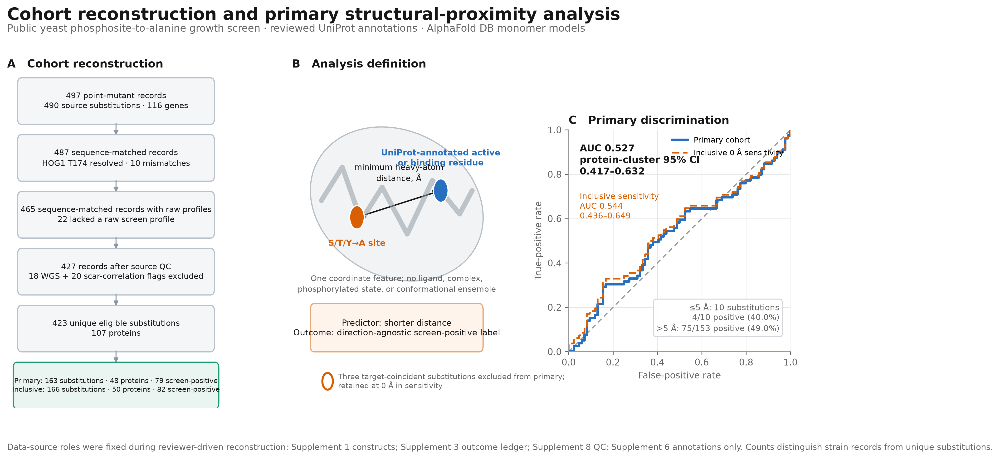
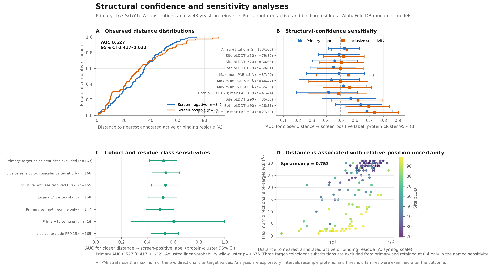

# Exploratory calibration of AlphaFold-derived distance to UniProt ACT_SITE and BINDING coordinates against yeast phosphomutant growth-screen phenotypes

**Kyle Nguyen**^1^

^1^ Independent researcher

**Draft status:** complete scientific draft; not for public posting until the author identity fields, external archive, source-file rights, and independent methods review are resolved.

## Abstract

Proximity to an annotated feature coordinate is often used to prioritize post-translational modification sites, but the discriminatory value of a single distance feature against mutant-screen phenotypes is uncertain. We performed an exploratory secondary analysis of a public *Saccharomyces cerevisiae* screen of serine, threonine, and tyrosine-to-alanine mutants. The cohort was reconstructed from the raw 102-condition screening ledger with sequence validation, strain-specific source quality-control exclusions, and replicate aggregation. The endpoint was a direction-agnostic any-condition screen phenotype. The primary cohort excluded three substitutions that were themselves an expanded `ACT_SITE` or `BINDING` coordinate from a reviewed UniProt yeast entry. It contained 163 substitutions from 48 proteins, of which 79 had at least one condition with a source-reported q-value below 0.05. Minimum residue–residue heavy-atom distance in AlphaFold DB v6 monomer models produced an area under the receiver-operating-characteristic curve (AUC) of 0.527 (protein-cluster bootstrap 95% confidence interval, 0.417–0.632). A named inclusive sensitivity retained the three substitutions at 0 Å and gave AUC 0.544 (0.436–0.649) on 166 substitutions. Primary screen-positive and screen-negative median distances were 26.23 Å and 31.83 Å. Only 10 primary substitutions lay within 5 Å. Twenty-three proteins contained both outcome classes; pair-weighted within-protein AUC was 0.528 (0.368–0.709), and the equal-protein-weight estimate was 0.497 (0.351–0.642). A post-result SIFT comparison on 152 primary-arm substitutions gave AUC 0.606 (0.522–0.690); the paired SIFT-minus-distance difference was 0.074 (−0.037 to 0.192). This single monomeric distance feature showed weak and imprecise discrimination in an annotation-selected yeast cohort. The primary interval excludes discrimination materially above 0.632, but its upper endpoint is not a predeclared utility margin. The analysis does not establish that distance is uninformative, that alanine-mutant growth directly measures phosphorylation dependence, or that a universal distance threshold is valid or invalid.

**Keywords:** phosphorylation; AlphaFold; yeast; mutational phenotype; structural bioinformatics; calibration; exploratory analysis

## Introduction

Protein phosphorylation can alter conformation, molecular interactions, localization, and enzymatic activity, yet most observed phosphosites lack a direct functional characterization. Large-scale prioritization efforts therefore combine evolutionary conservation, sequence context, protein domains, structural exposure, interfaces, and proximity to annotated residues [1–4]. These approaches rank sites that merit follow-up; they do not automatically calibrate any one feature against an experimental phenotype.

Structural proximity is biologically plausible but heterogeneous. Conserved phosphorylation hotspots are enriched near catalytic residues and protein interfaces [2], and multifeature phosphosite scores include several structural descriptors [3]. StructureMap extended proteome-scale post-translational-modification analysis to AlphaFold models while emphasizing predicted aligned error and model confidence [4]. The relevant estimands differ, however. Enrichment of conserved hotspots near catalytic residues does not imply that nearest-residue distance will discriminate a growth phenotype after alanine substitution.

AlphaFold models make proteome-scale distance measurements possible [5,6], but the resulting coordinate is conditional on the model. A monomer prediction does not contain bound ligands, obligate partners, phosphorylation, alternative conformations, or a cellular environment. Local pLDDT describes confidence around a residue, while predicted aligned error (PAE) addresses confidence in relative placement. Low-confidence and disordered phosphosites can therefore yield numerically precise distances whose biological interpretation is weak [4,8].

Viéitez and colleagues generated a public collection of yeast phosphosite-to-alanine strains and measured growth across 102 conditions [1]. We used those data to ask a narrow calibration question: does shorter minimum residue–residue heavy-atom distance from the substituted residue to the nearest expanded `ACT_SITE` or `BINDING` coordinate from a reviewed UniProt yeast entry discriminate a direction-agnostic any-condition screen phenotype? The initial analysis was observed before the confidence, within-protein, continuous-outcome, comparator, and predictive analyses were specified. A reviewer-style audit subsequently identified cohort-construction and exact-overlap errors, so the cohort was rebuilt from the raw screen before manuscript drafting. The corrected result and all later analyses remain exploratory.

## Results

### Raw-ledger reconstruction yielded 163 primary substitutions

Supplementary Data 1 of Viéitez et al. contained 497 point-mutant strain records representing 490 source-coordinate substitutions across 116 genes (Figure 1A; Table 1). Of these, 487 strain records matched the reviewed UniProt sequence after one provisional coordinate resolution. The source workbooks label PBY107 as HOG1 T178A, whereas the article identifies HOG1 T174A as the regulatory control and T174 matches the reviewed sequence. We analyzed PBY107 at T174 and report an inclusive-arm exclusion sensitivity because the source files are internally inconsistent.

Among the 487 sequence-matched records, 465 had a raw Supplementary Data 3 growth profile. Eighteen carried a Supplementary Data 8 WGS quality-control note and 20 were specifically listed as correlated with a scar control. Applying these strain-level exclusions left 427 records, 423 unique substitutions, and 107 proteins. Supplementary Data 6 was used only for optional annotations; it did not determine cohort eligibility or the primary outcome.

UniProt release 2026_02 records were retrieved for the 107 proteins. Fifty proteins carried at least one `Active site` or `Binding site` feature. The entries were reviewed, but feature eligibility was not restricted to direct experimental evidence. The preserved feature payload contained 41 active-site and 221 binding-site feature records; expansion of interval features produced 564 feature-residue rows representing 560 unique target residues. All 169 structurally eligible strain records mapped to AlphaFold DB v6 models. Averaging replicated constructs produced 166 unique substitutions. Three screen-positive substitutions coincided with an expanded target coordinate—TDH3 S149, TDH3 T151, and PRM15 S158. The primary cohort excludes these records and contains 163 substitutions from 48 proteins, including 79 screen-positive substitutions. The named inclusive sensitivity retains all three at 0 Å and contains 166 substitutions from 50 proteins, including 82 screen-positive substitutions.

### Shorter distance showed weak and imprecise discrimination

In the primary arm, outcome-positive substitutions had a median nearest-target distance of 26.23 Å, compared with 31.83 Å among outcome-negative substitutions. With shorter distance scored toward a positive outcome, site-weighted AUC was 0.527 (protein-cluster bootstrap 95% CI, 0.417–0.632; Figure 1C). The inclusive 0 Å sensitivity gave AUC 0.544 (0.436–0.649). A primary substitution-level bootstrap that ignored within-protein dependence gave 0.437–0.617 and is reported only as a dependence diagnostic.

In a primary-arm logistic model with protein-cluster sandwich covariance, the odds ratio per ten-fold increase in distance + 1 Å was 0.77 (95% CI, 0.27–2.15). Adding site pLDDT and relative solvent accessibility changed the odds ratio to 1.31 (0.38–4.51). These intervals include both potentially meaningful positive discrimination by shorter distance and weak discrimination in the opposite direction.

Only 10 primary substitutions were within 5 Å. Four of 10 (40.0%) were outcome-positive, compared with 75 of 153 (49.0%) beyond 5 Å. At 8, 10, and 15 Å, the corresponding primary outcome-positive rates were 60.0%, 56.7%, and 55.8%. The inclusive 5 Å group contains 13 substitutions because it adds three outcome-positive exact overlaps. These post-result threshold summaries are descriptive and based on nested groups; they are not independent tests of universal cutoffs.

### Relative-position uncertainty was coupled to measured distance

Primary median site pLDDT was 46.50. Maximum directed pair PAE increased with measured separation (Spearman ρ = 0.753; protein-bootstrap 95% CI, 0.661–0.827) and decreased with site pLDDT (ρ = −0.795; −0.852 to −0.688; Figure 2D). Long distances therefore partly coincide with uncertain relative placement.

Confidence restrictions did not produce a monotonic pattern (Figure 2B). Using `pae_pair_max`, primary-arm AUCs at thresholds of 5, 10, and 15 Å were 0.488, 0.436, and 0.520; the inclusive sequence was 0.555, 0.496, and 0.564. Primary AUC was 0.459 (0.303–0.618) among 60 sites with pLDDT at least 70, 0.450 (0.288–0.606) among 58 sites with both residues at least 70, and 0.416 (0.192–0.617) among 41 sites satisfying both-residue pLDDT at least 70 and `pae_pair_max` at most 10 Å. At pLDDT at least 90, the corresponding estimates were 0.641 (0.464–0.789) among 28 sites with both residues above the threshold and 0.683 (0.481–0.864) among 27 sites also satisfying `pae_pair_max` at most 10 Å. Every declared stratum for both arms is shown in Figure 2B. These thresholds were selected after the outcome and form a nonmonotonic sensitivity family.

The PAE summary itself was not unique. At a 10 Å threshold in the primary arm, AUC was 0.436 for `pae_pair_max`, 0.459 for site-to-target PAE, 0.489 for pair-mean PAE, and 0.521 for target-to-site PAE. Across 72 combinations of four PAE columns, six thresholds, and three site-pLDDT floors, primary AUC ranged from 0.416 to 0.569. The joint `pae_pair_max` ≤10 Å and site-pLDDT ≥70 cell was the lowest of the 72 in the primary, inclusive, and legacy grids. These analyses are reported as sensitivity families, not as confidence-filtered results.

### Cohort and annotation sensitivities did not define a stable alternative estimate

Including the three exact overlaps at 0 Å increased AUC from the primary 0.527 (0.417–0.632) to 0.544 (0.436–0.649). Excluding the provisionally resolved HOG1 record from the inclusive arm gave 0.540 (0.433–0.645). Recreating the legacy Supplementary Data 6-selected cohort produced 158 substitutions and AUC 0.522 (0.408–0.632). The primary Ser/Thr-only estimate was 0.499 (0.389–0.605); the primary tyrosine estimate was 0.604 but involved 16 substitutions and had a 0.272–1.000 interval. Omitting PRM15 S158 from the inclusive arm gave AUC 0.539 (0.429–0.641).

In the primary arm, ACT_SITE-only distance gave AUC 0.570 (107 substitutions; 0.453–0.677), whereas BINDING-only distance gave 0.525 (155 substitutions; 0.415–0.632). Adding the broader UniProt SITE and DNA-binding classes changed the primary estimate by less than 0.002. Because feature definitions were examined after the outcome, these differences do not identify a preferred predictor.

### Within-protein estimates were centered near chance and imprecise

Twelve primary-arm proteins contained only outcome-positive substitutions, 13 contained only outcome-negative substitutions, and 23 contained both classes. The informative proteins contributed 112 substitutions and 176 within-protein positive-negative pairs. Pair-weighting those comparisons gave AUC 0.528 (protein-bootstrap 95% CI, 0.368–0.709); assigning equal weight to each informative protein gave 0.497 (0.351–0.642). Converting each primary distance to its empirical percentile within the corresponding protein gave AUC 0.511 (0.412–0.612). These analyses reduce across-protein architectural comparisons and did not reveal stronger discrimination.

### Continuous outcomes, SIFT, and grouped prediction remained exploratory

Replicate-strain S-scores were averaged within condition before calculating RMS, mean absolute score, and maximum absolute score. Primary-arm Spearman correlations with distance ranged from −0.115 to −0.076; each protein-bootstrap interval included zero. Cluster-robust linear models of `log1p(outcome)` were likewise imprecise. No negative-binomial model was fitted because replicate-averaged phenotype counts can be fractional.

Inverse SIFT score was available for 152 primary-arm substitutions. Its AUC was 0.606 (protein-cluster 95% CI, 0.522–0.690), compared with distance AUC 0.532 (0.418–0.647) on the same support. The paired SIFT-minus-distance difference was 0.074 (−0.037 to 0.192). SIFT was examined after the distance result; it is a post-result comparator, not independent validation.

Protein-isolated internal prediction used ten repeated stratified five-fold splits. Mean pair-weighted split AUC was 0.484 for distance alone, 0.558 for structural features, 0.590 for source annotations, and 0.587 for the combined model. Adding structural features to source annotations changed mean split AUC by −0.003, with a partition range of −0.039 to 0.034. These split-seed ranges describe algorithmic stability, not sampling confidence, and the feature sets were selected after viewing the outcome.

## Discussion

Minimum residue–residue heavy-atom distance to an expanded UniProt `ACT_SITE` or `BINDING` coordinate showed weak discrimination of a direction-agnostic any-condition yeast phosphomutant screen phenotype. The primary AUC of 0.527 is not a demonstrated null: its protein-cluster interval extends to 0.632. It is also not evidence of a useful classifier. Including three screen-positive exact overlaps at 0 Å moves the estimate to 0.544, illustrating why the target population and treatment of self-distance must be declared rather than left implicit.

The analysis provides little information about a 5 Å convention. Ten primary observations occupied that range, and their outcome-positive rate was 40.0%, compared with 49.0% beyond 5 Å. The inclusive sensitivity adds three outcome-positive exact overlaps to this stratum. A sparse post-result group cannot establish a universal boundary, and the relevant biological distance could depend on residue chemistry, mechanism, ligand state, and conformational change.

The measured feature is narrower than “spatial regulation.” AlphaFold monomer models omit protein partners and ligands, while phosphorylation can act through interfaces, allostery, disorder-to-order transitions, localization motifs, and degradation signals. The minimum over all heavy atoms can reflect backbone packing or local sequence adjacency; it is not a phosphoacceptor-oxygen or phosphate-to-target geometry. Strumillo et al. found conserved phosphorylation hotspots near catalytic residues and, more often, at interfaces [2]; that enrichment question is not contradicted by the present phenotype-discrimination result. Likewise, multifeature phosphosite scores [3] and structural-context tools [4] address broader information than one nearest-residue distance.

Model confidence constrains interpretation. Approximately half of the substituted sites had pLDDT below 50. Distance and pair PAE were strongly correlated. Restricting to high-confidence geometry reduced sample size and produced nonmonotonic estimates, including high AUCs in small very-high-confidence subsets. Because those thresholds were explored after the outcome was known, they should motivate an independently specified test rather than be read as a rescue of the primary feature.

The outcome is also a proxy. Alanine substitution removes phosphorylation potential but also changes side-chain chemistry. The direction-agnostic label pools growth impairment and growth enhancement and compresses up to 102 condition-specific profiles into one binary endpoint. For replicated substitutions, it also treats any positive retained strain as sufficient rather than requiring replicate agreement. It does not directly measure catalytic activity, phosphosite occupancy, or phosphorylation-dependent function. The high positive fraction among tyrosine substitutions may reflect mutation chemistry as well as biology; the tyrosine stratum was too small to separate these explanations.

Eligibility required an `Active site` or `Binding site` feature from a reviewed UniProt entry, creating an annotation-selected cohort. Reviewed entry status does not imply that every feature has direct experimental support. `BINDING` features were heterogeneous in ligand and evidence and sometimes covered residue intervals; each interval coordinate entered the target union equivalently. Proteins without these features could not enter even if another structural mechanism were relevant. Within-protein analyses reduced some across-protein architectural comparisons but did not create external representativeness. Broader SITE/DNA-binding sensitivities were conditional on the original core-eligible cohort and did not re-eligibilize proteins lacking `ACT_SITE` or `BINDING` features.

On common support, the paired SIFT-minus-distance estimate was 0.074 with an interval from −0.037 to 0.192. The primary SIFT point estimate of 0.606 also lies inside the full-cohort primary distance interval of 0.417–0.632, but that containment is descriptive rather than a paired test. The study therefore does not show that distance is uninformative or that it performs worse than SIFT. At the precision achieved here, chance-level ranking and SIFT-like discrimination are both compatible with the distance result. The primary interval excludes performance materially above its upper bound of 0.632 for this retrospectively defined estimand; the endpoint is not a formal equivalence or utility margin.

The next informative study is not a larger post-result feature search on this cohort. It is an analysis specified before outcome inspection on a compatible independent dataset, with explicit treatment of complexes, interfaces, residue class, ligands, and coordinate uncertainty. Until such a test exists, the present result is best treated as a transparent calibration of one interpretable heuristic and an example of the uncertainty that accompanies proteome-scale distance measurements on predicted structures.

## Methods

### Study design and analysis chronology

This study is an exploratory secondary analysis of public data. The initial Phase 0 analysis defined the binary outcome and nearest-ACT_SITE/BINDING distance before calculating the legacy AUC. Protein-cluster uncertainty, structural-confidence restrictions, alternative feature definitions, continuous outcomes, SIFT comparison, grouped prediction, within-protein estimates, and residue-class analyses were specified after that result. A subsequent reviewer-style audit identified the Supplementary Data 6 cohort-selection problem, the unresolved exact-overlap estimand, the HOG1 coordinate conflict, replicate handling, and an invalid two-proportion power calculation. The decision to exclude annotation-coincident substitutions from the primary estimand was made after outcome inspection; the literal-distance inclusive arm is therefore co-reported as a named sensitivity. The cohort was rebuilt, replicate profiles were averaged, and the power and negative-binomial claims were removed before this draft. The chronology is recorded in `robustness/ANALYSIS_PROVENANCE.md`.

### Source data and cohort construction

Supplementary workbooks from Viéitez et al. [1] were obtained from Europe PMC record PMC7612524. Point-mutant constructs came from Supplementary Data 1. Condition-level S-scores and q-values came from Supplementary Data 3. Supplementary Data 8 supplied WGS quality-control notes and exact phosphomutant records reported to correlate with scar controls. Supplementary Data 6 was used only for annotations such as SIFT, disorder, domain membership, age group, and phenotype-group labels.

Rows marked as point mutants were mapped from yeast systematic names to reviewed *S. cerevisiae* UniProt accessions using ordered-locus names. The stated wild-type residue was required to match the reviewed sequence at the resolved coordinate. PBY107 was provisionally changed from the workbook coordinate HOG1 T178 to T174 because the article names T174 as the regulatory control and T174 matches the reviewed sequence; an inclusive-arm exclusion sensitivity was retained. No other mismatch was silently shifted. A raw Supplementary Data 3 profile was required. Records with a nonempty Supplementary Data 8 WGS quality-control note or an exact entry in its scar-correlation table were excluded. The resulting disposition and reason for every point-mutant row are provided in `results/cohort_disposition.csv`.

### Outcome and replicate aggregation

For each strain, the number of raw conditions with source `qvalue < 0.05` was counted without regard to the sign of the S-score. A substitution was screen-positive if its replicate-averaged count was greater than zero. Because the counts are nonnegative, this rule is logically positive when any retained replicate has at least one called condition; replicate unanimity was not required. Two inclusive-arm substitutions had multiple retained strains: one was positive in both strains, and one was positive in two of three strains. The strain-level values are released in `robustness/results/replicate_aggregation_audit.csv`. For continuous S-score analyses, replicate-strain S-scores were first averaged within condition; RMS, mean absolute, maximum absolute, minimum, maximum, mean, and standard deviation were then calculated across conditions. These magnitude summaries are also direction-agnostic. The minimum raw q-value was retained as a source-significance summary, not an effect-size measure.

### UniProt features

The reviewed yeast proteome and UniProt feature records were retrieved through the UniProt REST API on 29 July 2026. The feature response reported UniProt release 2026_02, dated 10 June 2026 [7]. The primary target set comprised feature types `Active site` and `Binding site` from reviewed entries. Feature evidence was retained but was not used as an eligibility filter; reviewed entry status therefore does not imply direct experimental support for every included feature. Start and end coordinates, modifiers, ligand and ligand-part fields, evidence codes and identifiers, entry and sequence versions, update dates, and the complete JSON response were preserved. Multi-residue feature intervals were expanded to each covered residue. A feature-geometry/evidence audit is included in the supplement. Broader `Site` and `DNA binding` sensitivities were evaluated only within the original core-eligible cohort.

### AlphaFold models and structural measurements

AlphaFold DB metadata were queried by UniProt accession [5,6]. All included models were version 6 monomers. mmCIF files, model metadata, and PAE documents were cached with exact v6 source URLs, versions, creation metadata, and SHA-256 hashes. Before measurement, the release checks the full reviewed UniProt, AlphaFold metadata, and mmCIF sequences; contiguous residue numbering and sequence bounds; monomer and version fields; and square PAE dimensions against sequence length. A missing or changed cache fails closed.

The predictor was the minimum Euclidean distance between any heavy atom in the substituted residue and any heavy atom in an eligible target residue. It was not restricted to the phosphoacceptor oxygen, did not model a phosphate, and did not separate backbone contact from side-chain geometry or local sequence adjacency. Substitutions that were themselves an eligible target were excluded from the primary cohort. In the named inclusive sensitivity, their mathematically defined self-distance was 0 Å. Site and nearest-target pLDDT were calculated as the mean atom B factor stored in the AlphaFold mmCIF and interpreted as model-local confidence, not a disorder assay. Relative solvent accessibility was computed on the isolated monomer by Shrake–Rupley solvent-accessible surface area [9], divided by residue-specific theoretical maxima from Tien et al. [10]. For the coordinate-selected nearest site–target pair, both directed PAE values were retained; the larger value, `pae_pair_max`, was used for the declared PAE strata.

### Primary statistical analysis

The analysis unit was a unique amino-acid substitution. Smaller distance was scored toward an outcome-positive label. The primary estimand was the site-weighted AUC among substitutions that did not coincide with an eligible annotation, equivalent to the probability that an outcome-positive substitution had shorter distance than an outcome-negative substitution, with half credit for ties. The canonical 95% percentile interval, **0.417–0.632**, used 200,000 bootstrap resamples of protein accessions with seed 20260729; every substitution from a sampled protein was retained. The inclusive arm used the same draw count and seed. The primary substitution-level dependence sensitivity also used 200,000 draws. Post-result sensitivity AUC intervals used 20,000 draws. Stored arm intervals, rather than newly simulated realizations, were reused in every table and figure.

Logistic models used `log10(distance + 1)` and protein-cluster sandwich covariance. The descriptive cutoff set of 5, 8, 10, and 15 Å was fixed for post-result sensitivity analysis after the primary outcome had been inspected. The groups are nested and were not treated as independent threshold tests. No unclustered Mann–Whitney or Fisher p-value is used for inference. Precision is described by cluster intervals rather than a two-proportion power calculation. Convergence, predicted-probability, leverage, and standardized-residual diagnostics are released separately from the frozen model summary.

### Post-result analyses

Confidence strata used site pLDDT, nearest-target pLDDT, and **`pae_pair_max`**, the maximum of the two directed PAE entries for the coordinate-selected nearest target. All declared pLDDT and `pae_pair_max` strata are displayed for both arms. Because four PAE summaries were available, the analysis also reports all four columns at 10 Å and separate 72-cell grids for the primary, inclusive, and legacy cohorts. Feature-definition sensitivities used ACT_SITE, BINDING, their union, union with SITE, and union with SITE and DNA-binding annotations. Other sensitivities addressed the inclusive-arm PBY107 exclusion, residue class, PRM15 S158, and the legacy Supplementary Data 6-selected cohort.

Within-protein AUCs were computed for proteins containing both outcome classes. Estimates were aggregated by the number of positive–negative pairs and with equal protein weights; intervals resampled informative proteins. A separate predictor converted each distance to its within-protein percentile. Continuous-outcome Spearman intervals used 4,000 protein-cluster resamples. Linear models of `log1p(outcome)` used protein-cluster covariance. The adjusted linear-probability sensitivity used 9,999 Rademacher wild-cluster draws.

SIFT [11] was treated as a post-result comparator. AUCs for SIFT and distance were calculated on common support, and their difference used paired protein bootstrap resampling. Internal prediction used ten repeated stratified five-fold splits grouped by protein. Median imputation with missingness indicators, scaling, and logistic fitting occurred within each training fold. The reported split AUC was weighted by the number of positive–negative pairs in each test fold. Percentiles across ten split seeds are partition-stability ranges, not confidence intervals.

### Software and reproducibility

Analyses used CPython, NumPy, pandas, SciPy, statsmodels, scikit-learn [12], and Biopython. The interpreter patch version, direct and transitive Python dependencies, external PDF renderer, source-workbook hashes, and every redistributed UniProt/AlphaFold cache are recorded in the release. Random procedures and grouped-split contracts are listed in `NUMBERS.md`. The scientific verifier reconciles both cohort arms, outcomes, parent and child AUCs, structure and PAE completeness, source QC flags, feature-distance recomputation, output-table dimensions, manuscript text, PDF text, and rendered pages. This draft was generated only after the named primary and inclusive outputs passed those checks locally.

## Data and code availability

The source screen is available with Viéitez et al. [1] through Europe PMC (PMC7612524) and the publisher record. The source workbooks are not redistributed; the release retrieves the four required files from the authoritative Europe PMC endpoint and verifies their inner-file hashes. Exact UniProt and AlphaFold DB v6 cache identifiers, URLs, licenses, and SHA-256 values are included with the release candidate. Derived tables, code, manifests, and clean-room evidence are in the accompanying local analysis directory. A public repository and archive DOI have not yet been created; stable links will replace this sentence only after the reviewed release candidate is deposited.

## Ethics statement

This secondary computational analysis used public nonhuman yeast data and required no human-participant or animal-subject approval.

## Funding

No specific funding supported this independent secondary analysis. Author confirmation is required before posting.

## Competing interests

The draft declares no competing interests. Author confirmation is required before posting.

## Author contributions

Draft CRediT statement: Kyle Nguyen—conceptualization, data curation, formal analysis, investigation, methodology, software, validation, visualization, writing—original draft, and writing—review and editing. Final author confirmation is required before posting.

## Acknowledgements

The author thanks Viéitez and colleagues for making the yeast phosphomutant screen and supplementary data available. No individual reviewer is named in this draft.

## AI-assistance disclosure

Proposed final disclosure, pending author confirmation: generative AI tools assisted code development, debugging, reviewer-style critique, literature organization, and language editing. Before posting, the human author must confirm that he inspected the source data, executed and checked the analyses, reviewed the manuscript, and accepts responsibility for all claims, code, and reported results. AI tools are not authors.

## Tables

### Table 1. Cohort reconstruction

| Stage | Strain records | Unique substitutions | Proteins | Role or exclusion |
|---|---:|---:|---:|---|
| Point-mutant source rows | 497 | 490 source-coordinate substitutions | 116 | Supplementary Data 1 constructs |
| Sequence matched after PBY107 resolution | 487 | 479 resolved-coordinate substitutions | 113 | 10 unresolved mismatch records excluded |
| Sequence matched with raw profile | 465 | 458 | 111 | 22 matched records lacked Supplementary Data 3 profiles |
| After WGS exclusion | 447 | 443 | 110 | 18 source WGS flags excluded |
| After scar-correlation exclusion | 427 | 423 | 107 | 20 exact source scar-correlation entries excluded |
| Core annotation and structure eligible | 169 | 166 | 50 | ACT_SITE/BINDING; replicate strains aggregated |
| Primary after exact-overlap exclusion | — | 163 | 48 | 79 outcome-positive substitutions |
| Inclusive 0 Å sensitivity | — | 166 | 50 | 82 outcome-positive substitutions |

### Table 2. Selected results, status, and timing

| Analysis | Estimate | 95% interval or stability range | Status and timing |
|---|---:|---:|---|
| Primary distance AUC | 0.527 | 0.417–0.632 | Post-outcome estimand decision; exact overlaps excluded |
| Inclusive 0 Å sensitivity AUC | 0.544 | 0.436–0.649 | Co-reported post-outcome estimand sensitivity |
| Logistic OR per 10-fold distance + 1 Å | 0.77 | 0.27–2.15 | Primary arm, clustered |
| pLDDT/RSA-adjusted logistic OR | 1.31 | 0.38–4.51 | Primary arm, clustered |
| Pair-weighted within-protein AUC | 0.528 | 0.368–0.709 | Post-result reviewer sensitivity |
| Equal-protein within-protein AUC | 0.497 | 0.351–0.642 | Post-result reviewer sensitivity |
| Joint pLDDT ≥70 / `pae_pair_max` ≤10 AUC | 0.416 | 0.192–0.617 | Primary post-result sensitivity |
| Joint pLDDT ≥90 / `pae_pair_max` ≤10 AUC | 0.683 | 0.481–0.864 | Primary post-result sensitivity |
| SIFT AUC, primary common support | 0.606 | 0.522–0.690 | Post-result comparator |
| SIFT minus distance AUC | 0.074 | −0.037 to 0.192 | Post-result paired comparator |
| Structural increment over source annotations | −0.003 | −0.039 to 0.034 | Internal split-stability range |

## Figure legends

**Figure 1. Raw-ledger reconstruction and primary calibration.** (A) Sequential cohort reconstruction distinguishes strain records from unique substitutions and shows the primary and inclusive arms. (B) The declared predictor is minimum residue–residue heavy-atom distance from an S/T/Y→A site to the nearest expanded UniProt ACT_SITE or BINDING coordinate in an AlphaFold DB v6 monomer. Annotation-coincident substitutions are excluded from primary and retained at 0 Å in the inclusive sensitivity. The direction-agnostic binary endpoint is at least one raw condition with q<0.05 under the replicate rule described in Methods. (C) Receiver-operating-characteristic curves for both arms, with shorter distance oriented toward a screen-positive label. The intervals resample proteins. The ≤5 Å primary counts are descriptive.

**Figure 2. Structural confidence and sensitivity of AlphaFold-derived phosphosite proximity.** (A) Primary-arm empirical cumulative distance distributions by direction-agnostic screen-phenotype status. (B) Protein-cluster AUC intervals for primary and inclusive arms across every declared post-result confidence stratum; all PAE rows use `pae_pair_max`. (C) Cohort sensitivities, including primary, inclusive, and legacy cohorts, the inclusive PBY107 exclusion, residue class, and PRM15 S158. (D) Maximum directed pair PAE versus distance in the primary arm, colored by site pLDDT. High-confidence subsets are small and were examined after the primary result.

## References

1. Viéitez C, Busby BP, Ochoa D, et al. High-throughput functional characterization of protein phosphorylation sites in yeast. *Nature Biotechnology*. 2022;40:382–390. doi:[10.1038/s41587-021-01051-x](https://doi.org/10.1038/s41587-021-01051-x).
2. Strumillo MJ, Oplová M, Viéitez C, et al. Conserved phosphorylation hotspots in eukaryotic protein domain families. *Nature Communications*. 2019;10:1977. doi:[10.1038/s41467-019-09952-x](https://doi.org/10.1038/s41467-019-09952-x).
3. Ochoa D, Jarnuczak AF, Viéitez C, et al. The functional landscape of the human phosphoproteome. *Nature Biotechnology*. 2020;38:365–373. doi:[10.1038/s41587-019-0344-3](https://doi.org/10.1038/s41587-019-0344-3).
4. Bludau I, Willems L, Zeng W-F, et al. The structural context of posttranslational modifications at a proteome-wide scale. *PLoS Biology*. 2022;20:e3001636. doi:[10.1371/journal.pbio.3001636](https://doi.org/10.1371/journal.pbio.3001636).
5. Jumper J, Evans R, Pritzel A, et al. Highly accurate protein structure prediction with AlphaFold. *Nature*. 2021;596:583–589. doi:[10.1038/s41586-021-03819-2](https://doi.org/10.1038/s41586-021-03819-2).
6. Varadi M, Bertoni D, Magana P, et al. AlphaFold Protein Structure Database in 2024: providing structure coverage for over 214 million protein sequences. *Nucleic Acids Research*. 2024;52:D368–D375. doi:[10.1093/nar/gkad1011](https://doi.org/10.1093/nar/gkad1011).
7. The UniProt Consortium. UniProt: the Universal Protein Knowledgebase in 2023. *Nucleic Acids Research*. 2023;51:D523–D531. doi:[10.1093/nar/gkac1052](https://doi.org/10.1093/nar/gkac1052).
8. Akdel M, Pires DEV, Pardo EP, et al. A structural biology community assessment of AlphaFold2 applications. *Nature Structural & Molecular Biology*. 2022;29:1056–1067. doi:[10.1038/s41594-022-00849-w](https://doi.org/10.1038/s41594-022-00849-w).
9. Shrake A, Rupley JA. Environment and exposure to solvent of protein atoms: lysozyme and insulin. *Journal of Molecular Biology*. 1973;79:351–371. doi:[10.1016/0022-2836(73)90011-9](https://doi.org/10.1016/0022-2836%2873%2990011-9).
10. Tien MZ, Meyer AG, Sydykova DK, Spielman SJ, Wilke CO. Maximum allowed solvent accessibilities of residues in proteins. *PLoS ONE*. 2013;8:e80635. doi:[10.1371/journal.pone.0080635](https://doi.org/10.1371/journal.pone.0080635).
11. Ng PC, Henikoff S. SIFT: predicting amino acid changes that affect protein function. *Nucleic Acids Research*. 2003;31:3812–3814. doi:[10.1093/nar/gkg509](https://doi.org/10.1093/nar/gkg509).
12. Pedregosa F, Varoquaux G, Gramfort A, et al. Scikit-learn: machine learning in Python. *Journal of Machine Learning Research*. 2011;12:2825–2830.
